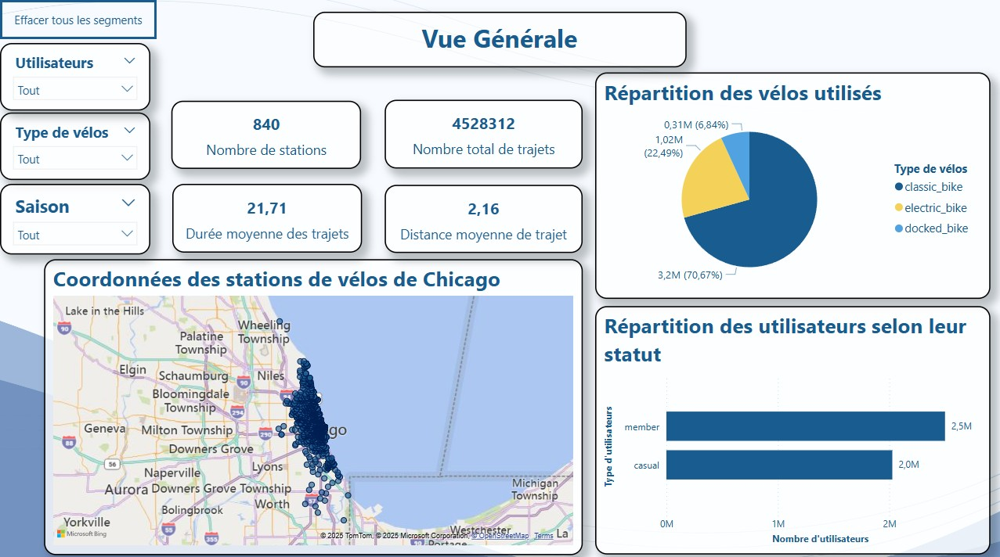
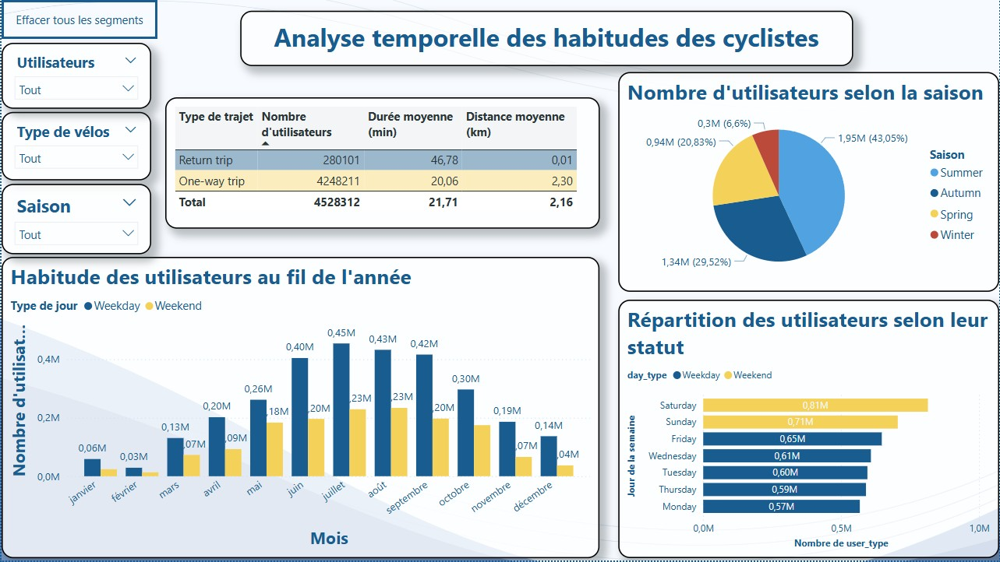
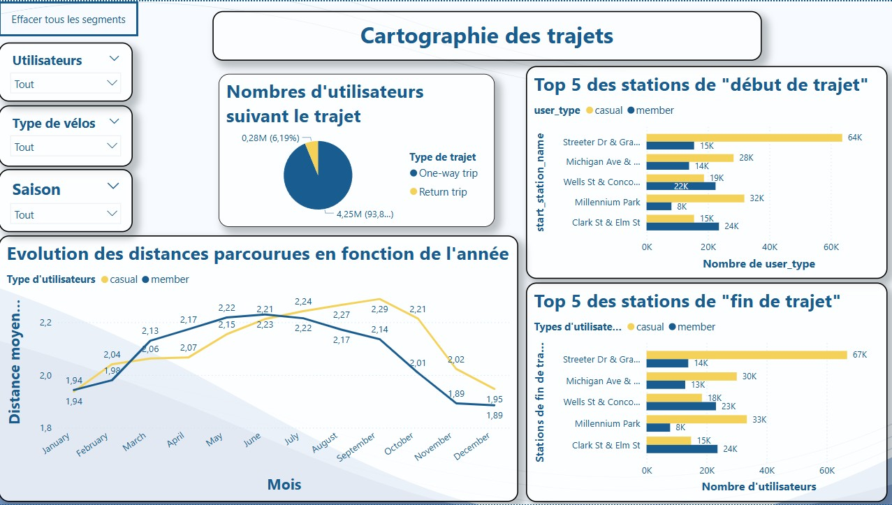

# Cyclistic-Dashboard

# 🚴‍♂️ Analyse de l’usage des vélos en libre-service à Chicago - Projet Power BI

## 📌 Présentation
Ce projet a été réalisé dans le cadre d'une étude de cas sur les données de l'entreprise **Cyclistic**, un service de vélos en libre-service basé à Chicago. L'objectif est d'analyser les différences d'utilisation entre les **cyclistes occasionnels** et les **membres abonnés**, afin d’identifier des opportunités d’**optimisation commerciale** et **opérationnelle**.

## 🎯 Objectifs métiers
- Comprendre les comportements différenciés entre les utilisateurs selon leur type d’abonnement
- Proposer des pistes pour convertir les cyclistes occasionnels en abonnés
- Identifier les zones de forte activité pour proposer de nouvelles stations
- Suggérer des axes d'amélioration de l’expérience utilisateur

## 🧠 Questions d'analyse
- Comment les membres annuels et les cyclistes occasionnels utilisent-ils les vélos différemment ?
- Quels leviers marketing ou digitaux peuvent inciter les utilisateurs occasionnels à devenir membres ?
- Quelles stations sont les plus fréquentées ? Et à quels moments de la semaine ?
- Où implanter de nouvelles stations pour améliorer le service ?

## 📊 Résultats clés
- **55 %** des trajets sont réalisés par des membres abonnés
- Les jours de **week-end** concentrent la majorité des trajets
- Les stations les plus populaires sont situées dans les zones touristiques et centrales
- Recommandation d'analyse horaire pour adapter les horaires de maintenance et d’approvisionnement

## 🛠️ Technologies utilisées
- **Power BI** (modélisation, nettoyage, DAX, visualisation)
- **Excel / CSV** (préparation des données)
- Visualisations : cartes, barres, lignes, camemberts, KPI cards

## 💡 Compétences mobilisées
- Modélisation de données relationnelles dans Power BI
- Écriture de mesures DAX pour le calcul des KPIs
- Recommandations opérationnelles basées sur les insights
- Mise en forme d’un rapport dynamique et interactif

## 🖼️ Aperçu du dashboard

## 📁 Contenu du dépôt
- `Cyclistic_Report.pbix` : fichier Power BI du rapport complet
- `images/` : captures d’écran du rapport
- `README.md` : documentation du projet

---

👤 **Auteur** : Williams VDB  
📧 Contact : [Ton email ou LinkedIn si tu veux]  
🎯 Projet destiné à intégrer un portfolio data analyst

